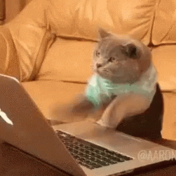

# typing_game_project: Typing Kareoke
I really had a song stuck in my head (The Black Parade) when I was trying to think of a simple game I could code within the given time and decided a music themed typing game would be fun. I started out by studying just single word typing games and expanding on the idea by inserting the lyrics of a song. The goal is to finish typing the lyrics before the progress bar is filled. 

Link to game: https://regularvanessaperson.github.io/typing_game_project/

### Technologies used
- HTML
- CSS
- JavaScript

## Game making basic goals
0. Basic layout of the game planned 
    - want it to look kind of like a youtube lyric video 
1. Get text/typing to work 
2. Get each string to show after previous one is typed 
3. Get progress bar to show 
    - stop the game if player is not done typing 
    - stop progress bar if player finishes before it is done
        -display a winning message (not an alert) 
4. Get play button to start the game and progress bar at the same time 
5. Play song in the background while playing the game 
    - activates with start button

#### Original Wireframe
The final product looks similar but I was not able to add as many choices as I originally thought. Midway through the process of working on this I decided to focus on making the game work well.

## Stretch goals
6. Restart button to restart at any time
7. Have more than one song choice or make timer faster
    - maybe an easy, medium, hard
8. Truly some better styling in the future.

### Issues I encountered
- When making spans out of each character the cursor skips over them
    and it makes the game look a bit broken while playing
    - was caused by using the refresh button but it left all of the typing{key} function's event listeners from the previous game on so it would get worse with each refresh. The the solution was to separate the typing function so that the event listener could be added and removed
- Styling was a challenge that I didn't get to overcome yet. I set up the basic colors and the style of the game early on and felt paralized every time I made a change. This game can truly be whatever it wants now and I hope to be able to update it in the future.

